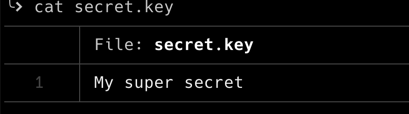

# secrets encryptions

As with any deployments, there a number of values we want to put in the Ansible playbooks. Those values should be encrypted so they can be stored in any public repository.

In order to achieve that, we have two options: [Ansible Vault](https://docs.ansible.com/ansible/latest/user_guide/vault.html#encrypt-string-for-use-in-yaml) or [git-crypt](https://github.com/AGWA/git-crypt).

## Ansible Vault

the encryption of a variable is fairly easy:

```shell
ansible-vault encrypt_string --vault-password-file ~/.vault_password 'my super secret' --name 'the_secret'
```

which gives the output:

```shell
the_secret: !vault |
          $ANSIBLE_VAULT;1.1;AES256
          32353838646534613230666565323233353533383530663064333866343965626665383366343631
          3835653231353434356332646632643564326231313062390a386366363935333764643236616464
          38623363656632396265653332383538313565306538373637653133326663616330316332613935
          3730346163393034300a666461346437383164383131653562333535623265303166616131366634
          3564
Encryption successful
```

From there, it is easy to put the content of the variable into a playbook.

When running the playbook, you simply have to provide the path to the password file:

```shell
ansible-playbook --vault-password-file ~/.vault_password
```

### Pros

- already part of Ansible
- can encrypt both variables and files
- easy to put in place

### cons

- can be tedious over time
- quite easy to forget to encrypt a file or a variable

## git-crypt

The approach of git-crypt is fairly different from Ansible Vault. Instead of manually having to encrypt values, git-crypt offers a process that is transparent to the developer. Once setup, the developer can stop thinking about the encryption / decryption process.

### Encryption

As the encryption is managed by git-crypt, the setup occurs at the repository level.

- Initiate the git repository

  ```shell
  git init
  ```

- Initiate the encryption of the repository

  ```shell
  git-crypt init
  ```

- Then you should set up the file names patterns of file that will be encrypted (`.gitattributes`)

  ```
  secretfile filter=git-crypt diff=git-crypt
  *.key filter=git-crypt diff=git-crypt
  secretdir/** filter=git-crypt diff=git-crypt
  ```

- [optional] you can decide to export the encryption key (e.g. using a shared secret)

  ```shell
  git-crypt export-key /path/to/key
  ```

From there you're all set. All commits and pushes will transparently encrypt the files described in the `.gitattributes` file

### Example

The file is directly accessible in the file system:



While it is not accessible in the repository:


### decryption

Once you have cloned the repository and have access to the key, you can issue:

```shell
git-crypt unlock ~/.git-crypt-key
```

### Pros

- The encryption process is transparent. Risks are very low to forget to encrypt a value / file
- Easy to use

### Cons

- Not native to Ansible
- When using the wrong key to unlock the repository, all encrypted files get deleted
